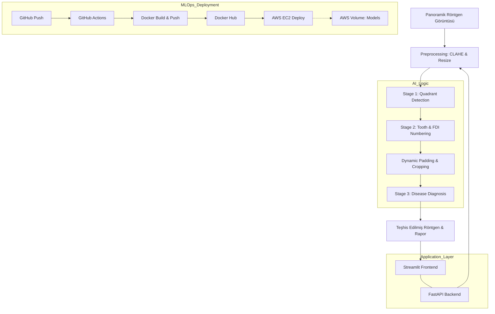

<div align="center">


</div>


---

# Tooth Detection Classification: End-to-End MLOps Pipeline

Bu proje, panoramik dental röntgen görüntülerinden diş hastalıklarının teşhis sürecini otomatize etmek ve diş hekimlerinin karar verme süreçlerine destek olmak amacıyla geliştirilmiş **3 aşamalı (hierarchical)** bir derin öğrenme sistemidir.

---

## Proje Vizyonu
Geleneksel diş hastalıkları teşhisi, yoğun iş yükü altında gözden kaçabilecek detaylara gebedir. Bu proje, quadrant tespiti ile başlayan ve tekil diş bazlı hastalık teşhisi ile sonlanan uçtan uca bir yapay zeka asistanı sunarak teşhis hızını ve doğruluğunu artırmayı hedefler.

---

## Veri Seti: DENTEX
Proje, hiyerarşik etiketleme yapısına sahip olan ve Hugging Face üzerinde paylaşılan **[DENTEX Dataset](https://huggingface.co/datasets/ibrahimhamamci/DENTEX)** (Ibrahim Hamamci et al.) kullanılarak geliştirilmiştir. Veri seti, 2D panoramik röntgenler ve bunlara ait hiyerarşik patoloji etiketlerini içerir.

---

## Hiyerarşik Mimari (3-Stage Pipeline)

Sistem, karmaşık panoramik görüntüleri anlamlandırmak için parçala-yönet (divide and conquer) stratejisini izler:


| Aşama | Görev | Amacı | Sınıf Sayısı |
| :--- | :--- | :--- | :--- |
| **Stage 1** | **Quadrant Detection** | Çene yapısını 4 ana bölgeye ayırarak odaklanmayı sağlar. | 4 Sınıf (FDI Quadrants) |
| **Stage 2** | **Tooth Detection** | Bölge içindeki dişlerin tekil konumlarını ve FDI numaralarını belirler. | 4 Sınıf |
| **Stage 3** | **Disease Diagnosis** | Tespit edilen dişler üzerinde patoloji araması yapar. | Patoloji Sınıfları + **Healthy** (5 sınıf)|


---

## Teknik İnovasyonlar & Mühendislik Yaklaşımları

### 1. Veri Mühendisliği & Preprocessing
* **JSON to YOLO Conversion:** Karmaşık hiyerarşik JSON etiketleri, model eğitimi için optimize edilmiş YOLO formatına (`class x_center y_center width height`) dönüştürülmüştür.
* **CLAHE (Contrast Limited Adaptive Histogram Equalization):** Röntgenlerdeki düşük kontrast sorununu çözmek ve kanal detaylarını belirginleştirmek için uygulanmıştır.


* **Dinamik Padding:** Stage 2'den Stage 3'e geçerken, dişin çevresel dokusunu (kök ucu ve çevre dokular) kaybetmemek için bounding box'lara dinamik genişletme uygulanmıştır.
* **Dinamik Thresholding:** Her aşama için farklı güven eşikleri belirlenerek, quadrant tespiti için yüksek hassasiyet, hastalık tespiti için ise dengeli bir duyarlılık (recall) sağlanmıştır.

### 2. Sentetik Veri Üretimi: "Healthy" Sınıfı
Hastalık tespiti modellerinde "yalancı pozitif" (false positive) oranını düşürmek için, veri setindeki etiketlenmemiş (sağlam) dişlerden otomatik olarak **Healthy** sınıfı oluşturulmuştur. Bu, modelin sağlıklı doku ile patolojiyi ayırt etme yeteneğini %X oranında artırmıştır.

---

## Teknoloji Yığını (Tech Stack)

* **Core AI:** PyTorch, Ultralytics (YOLO serisi)
* **Backend:** FastAPI (Async Inference API)
* **Frontend:** Streamlit (Hekim Arayüzü)
* **DevOps & MLOps:** Docker, GitHub Actions, AWS EC2
* **Image Processing:** OpenCV, NumPy

---
## Frontend: Streamlit (Hekim Arayüzü)


## End-to-End MLOps: Deployment Mimarisi

Bu projenin en güçlü yönü, sadece bir model değil, tam otomatize edilmiş canlı bir sistem olmasıdır:


### Dockerization & Optimizasyon
API ve UI servisleri, izole konteynerler olarak paketlenmiştir. **Docker Layer Caching** stratejisi kullanılarak, bağımlılıkların (PyTorch, vb.) her seferinde indirilmesi engellenmiş ve build süreleri optimize edilmiştir.


### ⚙️ CI/CD Pipeline (GitHub Actions)
`git push` yapıldığı an tetiklenen otomasyon hattı:
1.  **Build:** Docker imajlarını oluşturur ve **Docker Hub**'a yükler.
2.  **Deploy:** **AWS EC2** sunucusuna SSH üzerinden bağlanarak mevcut konteynerleri günceller ve yayına alır.

### ☁️ Cloud Infrastructure (AWS)
* **Volume Mounting:** Model ağırlıkları (`.pt`) imajın içine gömülmek yerine sunucu üzerinde (EBS) tutulur. Bu sayede her deployment'ta devasa modellerin transfer edilmesine gerek kalmaz.
* **Security & Scalability:** Güvenlik grupları ile port bazlı erişim kontrolü sağlanmıştır.

### 🔄 İş Akış Diyagramı



---
## Quick Start & Access (Hızlı Erişim)

Projenin canlı demosuna ulaşmak veya konteynerleri kendi yerelinizde çalıştırmak için aşağıdaki bağlantıları kullanabilirsiniz:

### Live Demo
AWS EC2 üzerinde aktif:
```
http://18.193.138.156:8501
```

### 🐳 Docker Hub Images

**API Image**
```bash
docker pull senin_kullanici_adin/dental-api:latest
```

**UI Image**
```bash
docker pull senin_kullanici_adin/dental-ui:latest
```

---

## 🛠️ Local Run (Yerel Çalıştırma)

Projeyi kendi bilgisayarınızda Docker ile ayağa kaldırmak için:

```bash
# Repo'yu klonlayın
git clone https://github.com/znrdpt0/tooth-detection-classification.git

# Proje klasörüne girin
cd tooth-detection-classification

# Docker Compose ile tüm sistemi başlatın
docker-compose up -d
```

Uygulama başlatıldıktan sonra arayüze şu adresten erişebilirsiniz:

```
http://localhost:8501
```
## 📂 Proje Yapısı
```text
├── .github/workflows/ci.yml    # GitHub Actions Pipeline
├── src/
│   ├── main.py                 # FastAPI Backend
│   ├── services/               # Inference Logic
│   └── frontend/               # Streamlit UI
├── weights/                    # Model Weights (Sunucu üzerinde saklanır)
├── .dockerignore               # Build Optimizasyonu
└── requirements.txt            # Python Bağımlılıkları
